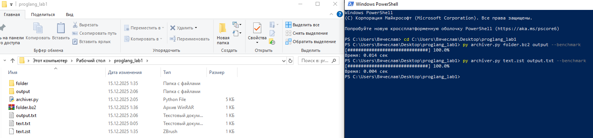

# Архиватор на Python 3.14
Консольная утилита для архивирования и распаковки файлов и директорий  
с использованием **стандартной библиотеки Python 3.14**.

Поддерживаются алгоритмы сжатия:
- **zstd**
- **bz2**

При работе с директориями предварительно используется архивирование в формат `tar`.

---

## Возможности

- Архивирование файлов
- Архивирование директорий (через `tarfile`)
- Распаковка файлов и директорий
- Автоматическое определение режима работы по расширению архива
- Поддержка форматов `.zst` и `.bz2`
- Замер времени выполнения (`--benchmark`)
- Консольный индикатор прогресса

---

## Использование
- Архивирование файла
- py archiver.py input.txt archive.bz2

- Архивирование директории
- py archiver.py folder archive.zst

- Распаковка архива с файлом
- py archiver.py archive.zst output.txt

- Распаковка архива с директорией
- py archiver.py archive.bz2 output_folder

- Замер времени выполнения (benchmark)
- py archiver.py archive.zst output.txt --benchmark
